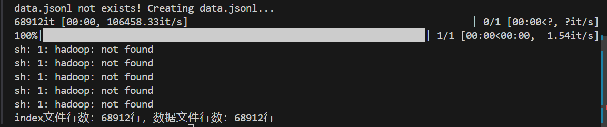

<style type="text/css">
    h1 { counter-reset: h2counter; }
    h2 { counter-reset: h3counter; }
    h3 { counter-reset: h4counter; }
    h4 { counter-reset: h5counter; }
    h5 { counter-reset: h6counter; }
    h6 { }
    h2:before {
      counter-increment: h2counter;
      content: counter(h2counter) ".\0000a0\0000a0";
    }
    h3:before {
      counter-increment: h3counter;
      content: counter(h2counter) "."
                counter(h3counter) ".\0000a0\0000a0";
    }
    h4:before {
      counter-increment: h4counter;
      content: counter(h2counter) "."
                counter(h3counter) "."
                counter(h4counter) ".\0000a0\0000a0";
    }
    h5:before {
      counter-increment: h5counter;
      content: counter(h2counter) "."
                counter(h3counter) "."
                counter(h4counter) "."
                counter(h5counter) ".\0000a0\0000a0";
    }
    h6:before {
      counter-increment: h6counter;
      content: counter(h2counter) "."
                counter(h3counter) "."
                counter(h4counter) "."
                counter(h5counter) "."
                counter(h6counter) ".\0000a0\0000a0";
    }
</style>

# 九格大模型使用文档
## 目录

<!-- - [仓库目录结构](#仓库目录结构) -->
- [九格大模型使用文档](#九格大模型使用文档)
  - [目录](#目录)
  - [环境配置](#环境配置)
  - [开源模型](#开源模型)
  - [数据处理流程](#数据处理流程)
    - [单个数据集处理](#单个数据集处理)
    - [多个数据集混合](#多个数据集混合)
  - [单机训练](#单机训练)
  - [多机训练](#多机训练)
  - [参数详细介绍](#参数详细介绍)
  - [查看训练情况](#查看训练情况)
  - [模型推理](#模型推理)
  - [常见问题](#常见问题)

<!-- ## 仓库目录结构
```
├── apps            # 不同项目的训练代码
├── bin             # 格式检查等脚本，通常与上线流程配合
├── fm9g             # 各项目通用的组件、模块
├── joker.yml
├── Makefile
├── README.md
├── pyproject.toml
├── requirements.txt
├── requirements_project.txt
├── setup.py
``` -->

## 环境配置
```shell
1. 使用python 3.8.10创建conda环境
conda create -n fm-9g python=3.8.10

2. 激活环境
conda activate fm-9g

3. 安装Pytorch 
# 需要先查看CUDA版本，根据CUDA版本挑选合适的pytorch版本
conda install pytorch==1.13.1 torchvision==0.14.1 torchaudio==0.13.1 pytorch-cuda=11.6 -c pytorch -c nvidia

4.安装OpenDelta
# 也可以在官网上下载好安装包后进行安装
# 官网地址为：https://github.com/thunlp/OpenDelta
pip install opendelta

5. 安装BMTrain
pip install bmtrain==1.0.0 

6. 安装flash-attn
pip install flash-attn==2.4.2  

7. 安装其他依赖包
pip install einops
pip install pytrie
pip install transformers
pip install matplotlib
pip install h5py
pip install sentencepiece

8.安装tensorboard
pip install protobuf==3.20.0 #protobuf版本过高时无法适配tensorboard
pip install tensorboard
pip install tensorboardX


9.安装vllm（模型推理）
我们提供python3.8、python3.10版本的vllm安装包，相关依赖均已封装，可直接安装后执行推理：
[vllm-0.5.0.dev0+cu122-cp38-cp38-linux_x86_64.whl](https://qy-obs-6d58.obs.cn-north-4.myhuaweicloud.com/vllm-0.5.0.dev0%2Bcu122-cp38-cp38-linux_x86_64.whl)
[vllm-0.5.0.dev0+cu122-cp310-cp310-linux_x86_64.whl](https://qy-obs-6d58.obs.cn-north-4.myhuaweicloud.com/vllm-0.5.0.dev0%2Bcu122-cp310-cp310-linux_x86_64.whl)
同时，我们也提供了vllm源码,位于/quick_start_clean/tools/vllm-0.5.0.dev0.tar
```

## 开源模型
1. 8B的百亿SFT模型，v2版本是在v1基础上精度和对话能力的优化模型，下载链接：
[8b_sft_model_v2(.pt格式)](https://qy-obs-6d58.obs.cn-north-4.myhuaweicloud.com/sft_8b_v2.zip), [8b_sft_model_v2(.bin格式)](https://qy-obs-6d58.obs.cn-north-4.myhuaweicloud.com/8b_sft_model.tar)

2. 端侧2B模型，下载链接：
[2b_sft_model(.pt格式)](https://qy-obs-6d58.obs.cn-north-4.myhuaweicloud.com/fm9g_2b_hf_models.tar.gz), [2b_sft_model(.bin格式)](https://qy-obs-6d58.obs.cn-north-4.myhuaweicloud.com/2b_sft_model.tar)

## 数据处理流程
### 单个数据集处理
预训练语料为无监督形式，不需要区分问题与答案，但需要将数据转为index后进行模型训练。我们拿到的原始数据可能是两种形式：
- 文件格式为.txt的原始文本，处理流程为：数据→jsonl格式的数据→index数据
- 文件格式为.jsonl的文本数据，处理流程为j:数据→index数据
1. 参考以下脚本，将txt数据处理为jsonl格式：
``` python
# convert_txt2jsonl.py
import json
import sys
for line in sys.stdin:
    if line.strip() == "":
        continue
    temp_json = {"input": "", "output": line.strip()}#预训练计算Loss时只计算output部分，所以input字段为空
    print(json.dumps(temp_json, ensure_ascii=False))
```

脚本使用方法如下，其中pretrain.txt是原始txt数据，pretrain.jsonl是输出的jsonl格式数据：
```shell
cat pretrain.txt | python convert_txt2jsonl.py > pretrain.jsonl
```

输出的jsonl文件中，其中每一行有两个字段：input字段与output字段。例如：
```JSON
{"input":"","output":"中国的首都是北京。"}
```

2. jsonl格式转index。脚本位于./quick_start_clean/convert_json2index.py，应用方法如下：

```shell
python convert_json2index.py \
--path ../data_process/data \ #存放jsonl文件的目录
--language zh \ #只能选择zh（中文）或者en（英文）
--output ../data_process/data_index \ #存放生成的index的目录，与原先存放jsonl文件的目录不能相同
--hdfs_name index  #index文件的文件名
```

<!-- 脚本运行成功时，会有如下显示：（不需要用hadoop所以不用管hadoop: not found的警告信息）

 -->

转完后，在index的目录下会生成四个文件：data.jsonl（原先的jsonl数据）、index、index.h5、meta.json（记录数据集信息，包含 "language", "nlines", "nbytes", "length_distribute", "avg_token_per_line", "hdfs_path", "data_sample"字段）。
这里有一个meta.json的例子：
```JSON
{"language": "en", "nlines": 68912, "nbytes": 41801261, "length_distribute": {"less_4k": 68911, "4k-8k": 1, "8k-16k": 0, "16k-32k": 0, "32k-64k": 0, "64k-128k": 0, "128k-256k": 0, "more_256k": 0}, "avg_token_per_line": 145.23292024611098, "hdfs_path": "/user/tc_agi/llm/index_datasets/index", "data_sample": {"input": "<用户>For a car, what scams can be plotted with 0% f...", "output": "The car deal makes money 3 ways. If you pay in one...", "source": "finance_cpm9g"}}
```

  ### 多个数据集混合
  我们支持多个数据集的混合读入，并设置不同数据集的比例。为此，需要准备一个数据混合的json文件，来指导训练过程中的数据读取策略，示例如下：
  ```JSON
  [
    {
        "dataset_name": "humanevallike_clean_dedup",
        "task_name": "humanevallike_clean_dedup",
        "abs_weight": 0.2,
        "path": "/data/0124_hq_data/humanevallike_clean_dedup",
        "transforms": "0124_hq_data/general/script_cpmc.py",
        "allow_repeat": true,
        "nlines": 995339,
        "ave_tokens_per_line": 100,
        "total_tokens": 0.1
    },
    {
        "dataset_name": "leetcode_pass_code_0125",
        "task_name": "leetcode_pass_code_0125",
        "abs_weight": 0.006,
        "path": "/data/0124_hq_data/leetcode_pass_code_0125",
        "transforms": "0124_hq_data/general/script_cpmc.py",
        "allow_repeat": true,
        "nlines": 10724,
        "ave_tokens_per_line": 200,
        "total_tokens": 0.002
    }
]
  ```

其中abs_weight需要自行设计；path、nlines、ave_tokens_per_line可以参考生成index时的meta.json进行填写；allow_repeat为数据集是否需要复制；total_tokens为估计的数据集token总数，以b（十亿）为单位，例如0.1代表0.1b个token，transforms为读入训练数据的脚本路径，该脚本可以参考以下代码：
```python
# script_cpmc.py
import random

def rand(n: int, r: random.Random):
    return int(r.random() * n)

def transform(data, num_sample: int, r: random.Random):
    if 'input' in data:
        _input = data['input']
    else:
        _input = ""
    
    if 'output' in data:
        _output = data['output']
    else:
        _output = ""
    return {"input": _input, 
            "output": _output,
            }
```

## 单机训练
1. 修改/apps/fm9g_2b/train_configs/2.4b.json中的训练参数，这一部分的参数设置会覆盖掉shell脚本中的相应部分。
2. 修改FM_9G-master/FM_9G-master/apps/fm9g_2b/pretrain_dragonfly.sh中最后部分的训练参数，如下所示：
```shell
GPUS_PER_NODE=2 #该节点上需要的GPU数量
NNODES=1 #单机训练无需修改这个参数
RANK=0 #单机训练无需修改这个参数
MASTER_ENDPOINT=g3006 #该节点名称
MASTER_PORT=12345 #该节点端口，注意避免端口冲突
```

3. 激活自己的训练环境：
```shell
conda activate fm-9g
```

4. 指定要用的GPU：
```shell
export CUDA_VISIBLE_DEVICES=0,1
```

5. 切换到fm9g_2b目录下，运行训练脚本：
```shell
cd FM_9G-master/FM_9G-master/apps/fm9g_2b
bash pretrain_dragonfly.sh
```

## 多机训练
需要保证机器之间能够通信，且每台机器上的训练环境、代码、数据等一致。以下教程以使用slurm调度的算力平台为例。
常用的slurm命令包括：
```
slurm命令    功能

sinfo    查看集群分区状态
squeue    查看作业队列
srun, salloc    交互式运行作业
sbatch    提交作业
scancel    取消作业
scontrol    查看和修改作业参数
sacct    查看已完成作业
```

注意：#slurm的多节点通信与bmtrain的环境变量有冲突，且srun不稳定，推荐采用slurm提交多个单节点任务，用torchrun的方式实现多节点通信。

1. 参考以下代码，编写主节点启动脚本run_master.sh：
```shell
#!/bin/bash
#SBATCH --partition=long
#SBATCH --nodes=1 #需要的节点数量，即需要几台机器，不建议修改，多机训练时提交多个单节点任务即可
#SBATCH --tasks-per-node=8 #每个节点的进程数，和每节点的GPU数量保持一致
#SBATCH --gres=gpu:8 #每个节点上需要几块GPU
#SBATCH --cpus-per-task=8 #每个任务分配的CPU数量（建议不要修改），该节点的cpu总数为任务数乘以每个任务的cpu数，这个示例脚本中的cpu总数为8x8=64
MASTER_ADDR=`hostname`
echo $MASTER_ADDR #可以在slurm-xxx.out中查看申请的主节点名称
while true;do
sleep 5s #
```

2. 启动主节点：
```shell
sbatch --nodelist g3002 run_master.sh
```

3. 登录主节点，激活训练环境：
```shell
ssh g3002 #登录节点
conda activate fm-9g #激活训练环境
export CUDA_VISIBLE_DEVICES=0,1 #指定要用的GPU
```

4. 修改主节点训练脚本：在/apps/fm9g_2b/pretrain_dragonfly.sh的最后修改主节点名称、端口、机器数量、GPU数量，并将脚本重命名为pretrain_dragonfly_master.sh，方便区分：
```shell
  GPUS_PER_NODE=2 #本节点上要用的GPU数量
  NNODES=2 #机器数量
  RANK=0 #0为主节点，1/2/3…为从节点
  MASTER_ENDPOINT=g3002 #主节点名称
  MASTER_PORT=12345 #主节点端口号，注意避免端口冲突
```

5. 提交主节点训练脚本：
```shell
cd FM_9G-master/FM_9G-master/apps/fm9g_2b
bash pretrain_dragonfly_master.sh
```

6. 启动从节点、激活训练环境，指定要用的卡，方法与主节点一样。

7. 修改从节点训练脚本：将单机多卡的训练脚本重命名为pretrain_dragonfly_slave.sh，在末尾修改主节点名称、端口、机器数量、GPU数量：
```shell
  GPUS_PER_NODE=2 #本节点上要用的GPU数量
  NNODES=2 #机器数量
  RANK=0 #0为主节点，1/2/3…为从节点
  MASTER_ENDPOINT=g3002 #主节点名称
  MASTER_PORT=12345 #主节点端口号，注意避免端口冲突
```

8. 提交从节点训练脚本：
```shell
cd FM_9G-master/FM_9G-master/apps/fm9g_2b
bash pretrain_dragonfly_slave.sh
```

9. 如果有三台及以上的机器，重复6-8，注意修改RANK编号
10.  开始训练后，每个iter的loss、lr等信息将在从节点上显示

## 参数详细介绍
``` python
#训练的名称，模型和log等信息会存储在该文件夹中
args["model_unique"]="2b_0701"

#若要resume，写resume的模型step
args["resume_ckpt"]=""

#config位置，在configs/目录中
args["config"]="2.4b"

#无需更改
args["flash"]="cuda"
args["max_length"]="4096"
args["local"]="False"
args["dataloader"]="indexed"
args["save"]="True"
args["tokenizer_path"]="./tokenizer/tokenizer.model" #  /user/tc_agi/klara/baichuan2/baichuan2.tokenizer.model
args["load_grad"]="False"
args["grad_ckpt_num"]="160"
args["exp_group"]=""
args["ignore_cuda_oom"]="1"
args["tensorboard_all_tasks"]="0"
args["stop_when_end"]="0"
args["only_run_dataloader"]="0"
args["eps"]="1e-6"
args["inspect_iters"]="100"
args["strict_state_dict"]="1"
args["resume_no_optimze"]="0"
args["tp_size"]="1"
args["async_save"]="False"

#训练batch size
args["batch_size"]="1"

#多久存一次
args["save_iters"]="500"

#总的iteration
args["train_iters"]="10000"

#在dataset_config/目录下，数据集的设置
args["dataset_config"]="fm9g_sft"

#dataloder 的加载线程的设置，如果配置较好，可以适量提高
args["dataloader_num_threads"]=1
args["dataloader_prefetch"]=1
args["dataloader_prefetch_factor"]=1
args["dataloader_num_workers"]=1
args["parallel_load_datastate"]="8"

#学习率
args["lr"]="1e-2"

#warmup的次数
args["warmup_iters"]="20"

#drop的比例
args["drop_iters"]="0.1"

#看是否仅load model
args["only_load_model"]="1"

#学习率下降方法
args["lr_scheduler"]="Cosine"

#可以直接resume训练数据信息
args["load_dataloader_ckpt"]="0"

#drop比例
args["drop_begin"]="-1"
args["drop_rate"]="0.5"
#是use checkpoint，建议使用
args["use_checkpoint"]="0"
```

## 查看训练情况
1. 用tensorboard查看各个loss曲线与学习率等变化情况：
```shell
tensorboard –-logdir /apps/fm9g_2b/data/tensorboard/2b_0701 #存放.events文件的路径
```

2. 出现以下报错信息时，说明protobuf版本过高，重新装一个低版本的即可：
```shell
TypeError: MessageToJson() got an unexpected keyword argument 'including_default_value_fields'
```

## 模型推理
模型推理列举了两种推理方法：离线批量推理和部署OpenAI API服务推理

### 离线批量推理：
离线批量推理可参考以下脚本：
``` python
# offline_inference.py
from vllm import LLM, SamplingParams

# 提示用例
prompts = [
    "Hello, my name is",
    "The president of the United States is",
    "The capital of France is",
    "The future of AI is",
]

# 设置采样参数以控制生成文本，更多参数详细介绍可见/vllm/sampling_params.py
# temperature越大，生成结果的随机性越强，top_p过滤掉生成词汇表中概率低于给定阈值的词汇，控制随机性
sampling_params = SamplingParams(temperature=0.8, top_p=0.95)

# 初始化语言模型,需注意加载的是.bin格式模型
llm = LLM(model="../models/9G/", trust_remote_code=True)

# 根据提示生成文本
outputs = llm.generate(prompts, sampling_params)

# 打印输出结果
for output in outputs:
    prompt = output.prompt
    generated_text = output.outputs[0].text
    print(f"Prompt: {prompt!r}, Generated text: {generated_text!r}")
```

在初始化语言模型部分，不同模型有所差异：
端侧2B模型：
``` python
# 初始化语言模型，与Hugging Face Transformers库兼容，支持AWQ、GPTQ和GGUF量化格式转换
llm = LLM(model="../models/2b_sft_model/", tokenizer_mode="auto", trust_remote_code=True)
```
8B百亿SFT模型：
``` python
# 初始化语言模型，tokenizer_mode需指定为"cpm"，不支持AWQ、GPTQ和GGUF量化格式转换
# 需要特别注意的是，由于8B模型训练分词方式差异，vllm库中代码有新增，需要按照“环境配置”安装指定版本vllm
llm = LLM(model="../models/8b_sft_model/", tokenizer_mode="cpm", trust_remote_code=True)
```

### 部署OpenAI API服务推理
vLLM可以为 LLM 服务进行部署，这里提供了一个示例：
1. 启动服务：

端侧2B模型：
```shell
python -m vllm.entrypoints.openai.api_server \
       --model ../models/2b_sft_model/ \
       --tokenizer-mode auto \ 
       --dtype auto \
       --trust-remote-code \ 
       --api-key CPMAPI
#同样需注意模型加载的是.bin格式
#与离线批量推理类似，使用端侧2B模型，tokenizer-mode为"auto"
#dtype为模型数据类型，设置为"auto"即可
#api-key为可选项，可在此处指定你的api密钥
```

8B百亿SFT模型：
```shell
python -m vllm.entrypoints.openai.api_server \
       --model ../models/8b_sft_model/ \ 
       --tokenizer-mode cpm \ 
       --dtype auto \
       --api-key CPMAPI
#与离线批量推理类似，使用8B百亿SFT模型，tokenizer-mode为"cpm"
```

执行对应指令后，默认在http://localhost:8000地址上启动服务，启动成功后终端会出现如下提示：
```shell
INFO:     Started server process [950965]
INFO:     Waiting for application startup.
INFO:     Application startup complete.
INFO:     Uvicorn running on http://0.0.0.0:8000 (Press CTRL+C to quit)
```

2. 调用API：
启动服务端成功后，重新打开一个终端，可参考执行以下python脚本：

``` python
# client.py
from openai import OpenAI
# 如果启动服务时指定了api密钥，需要修改为对应的密钥，否则为"EMPTY"
openai_api_key = "CPMAPI" 
openai_api_base = "http://localhost:8000/v1"
client = OpenAI(
    api_key=openai_api_key,
    base_url=openai_api_base,
)
completion = client.completions.create(model="../models/9G/",
                                      prompt="San Francisco is a")
print("Completion result:", completion)
```

## 常见问题
1. Conda安装pytorch时卡在solving environment：网络问题。
  解决方法：
  - 采用镜像源；
  - 用pip安装。安装时需要注意pytorch版本与cuda版本的对应，建议安装1.13.1及以上的版本。

2. 安装flash-attn时报错：ModuleNotFoundError: No module named 'packaging'。
   解决方法：pip install packaging即可。

3. flash attention 安装卡住：
  解决方法：从官方release下载对应版本(注意cuda、torch版本的对应) https://github.com/Dao-AILab/flash-attention/releases
  下载前先检查一下：
  ```python
      import torch
      print(torch._C._GLIBCXX_USE_CXX11_ABI)
  ```

  如果打印出来的结果是False，则选择文件名中带有abiFALSE的版本，否则选带有abiTRUE的版本。随后pip install +.whl文件名 即可。

4. 导入flash-attn时报错：undefined symbol: _ZN3c104cuda9SetDeviceEi。
   解决方法：建议检查flash-attn的版本与cuda、torch的版本是否对应。

5. 安装OpenDelta时，报错提示无法安装pandas 2.2.2版本：
  ```shell
  error: Couldn't find a setup script in /tmp/easy_install-bgpiop4j/pandas-2.2.2.tar.gz
  ```

  这是因为pandas 2.2.2需要python3.9及以上的版本。在python3.8的环境下，我们只需安装pandas 2.0.3版本即可。

6. 通过setup.py安装OpenDelta时报错：
  ```shell
  error: aiohttp 4.0.0a1 is installed but aiohttp!=4.0.0a0,!=4.0.0a1; extra == "http" is required by {'fsspec'}
  ```
  重新安装aiohttp即可，建议安装4.0.0以下的版本：
  ```shell
  pip uninstall aiohttp
  pip install aiohttp==3.9.5
  ```